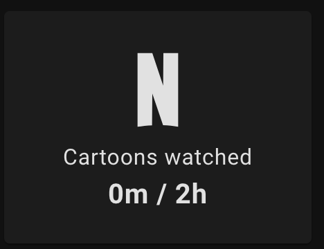
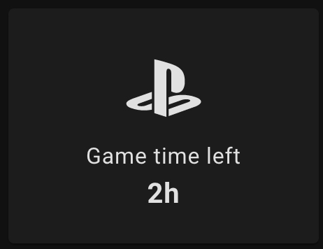
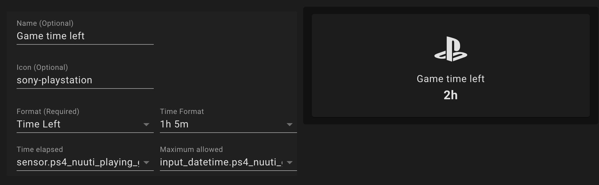
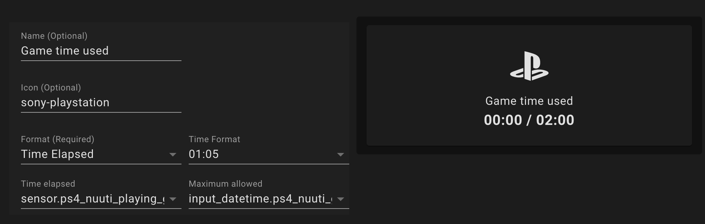
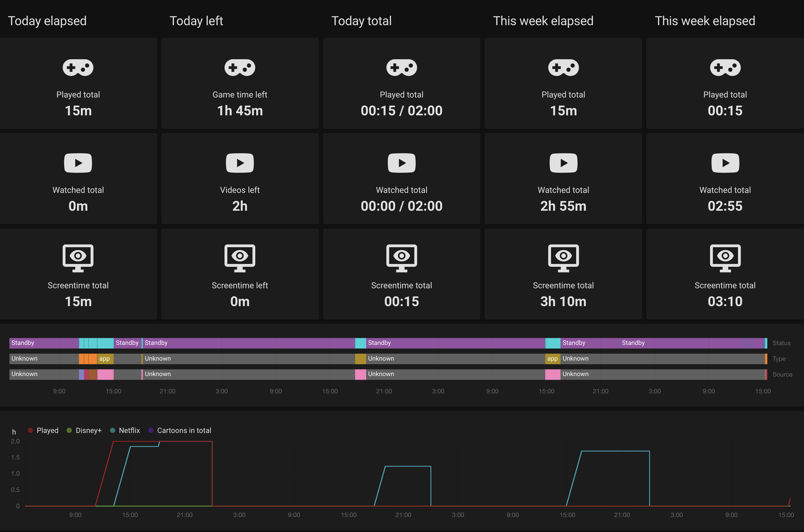
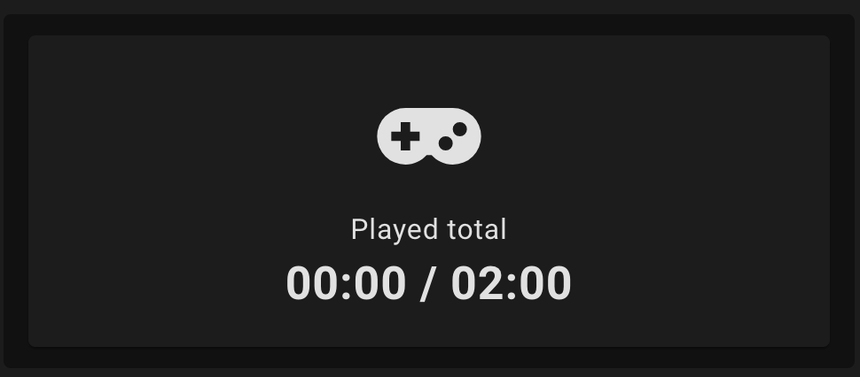

# Time Elapsed Card by [@kirbo](https://www.github.com/kirbo)

Time Elapsed card

[![GitHub Release][releases-shield]][releases]
[![License][license-shield]](LICENSE.md)
[](https://github.com/custom-components/hacs)

![Project Maintenance][maintenance-shield]
[![GitHub Activity][commits-shield]][commits]

[![Discord][discord-shield]][discord]
[![Community Forum][forum-shield]][forum]

## Support

Hey dude! Help me out for a couple of :beers: or a :coffee:!

[](https://www.buymeacoffee.com/kirbo)

## Options

| Name        | Type   | Requirement  | Description                | Default     |
| ----------- | ------ | ------------ | -------------------------- | ----------- |
| type        | string | **Required** | `custom:elapsed-time-card` |
| time_today  | string | **Required** | Home Assistant entity ID.  | `none`      |
| max_today   | string | **Optional** | Home Assistant entity ID.  | `none`      |
| format      | string | **Required** | Format for the card        | `Time Left` |
| time_format | string | **Required** | Card name                  | `1h 5m`     |
| name        | string | **Optional** | Name to show on card       | `none`      |
| icon        | string | **Optional** | Icon to show on card       | `none`      |

## Format Options

### `Time Elapsed`

Show time in `<time elapsed> / <time maximum>` format, e.g.: `01:54 / 02:00` or `1h 54m / 2h`, depending on `time_format` setting.

### `Time Left`

Show time in `<time remaining>` format, e.g.: `00:06` or `6m`, depending on `time_format` setting.

## Examples

### Card examples



```yaml
type: 'custom:elapsed-time-card'
format: Time Elapsed
time_format: 1h 5m
time_today: sensor.ps4_playing_game
max_today: input_datetime.ps4_game_time
name: Cartoons watched
icon: netflix
```



```yaml
type: 'custom:elapsed-time-card'
format: Time Left
time_format: 1h 5m
time_today: sensor.ps4_playing_game
max_today: input_datetime.ps4_game_time
name: Game time left
icon: sony-playstation
```

### Editor examples




### Panel example



```yaml
type: horizontal-stack
cards:
  - type: vertical-stack
    title: Today elapsed
    cards:
      - format: Time Elapsed
        time_format: 1h 5m
        type: 'custom:elapsed-time-card'
        name: Played total
        icon: gamepad-variant
        time_today: sensor.ps4_playing_game
      - format: Time Elapsed
        time_format: 1h 5m
        type: 'custom:elapsed-time-card'
        name: Watched total
        icon: youtube
        time_today: sensor.ps4_playing_app
      - format: Time Elapsed
        time_format: 1h 5m
        type: 'custom:elapsed-time-card'
        name: Screentime total
        icon: monitor-eye
        time_today: sensor.ps4_playing
  - type: vertical-stack
    title: Today left
    cards:
      - format: Time Left
        time_format: 1h 5m
        type: 'custom:elapsed-time-card'
        name: Game time left
        icon: gamepad-variant
        time_today: sensor.ps4_playing_game
        max_today: input_datetime.ps4_game_time
      - format: Time Left
        time_format: 1h 5m
        type: 'custom:elapsed-time-card'
        name: Videos left
        icon: youtube
        time_today: sensor.ps4_playing_app
        max_today: input_datetime.ps4_vod_time
      - format: Time Left
        time_format: 1h 5m
        type: 'custom:elapsed-time-card'
        name: Screentime left
        icon: monitor-eye
        time_today: sensor.ps4_playing
        max_today: sensor.ps4_playing
  - type: vertical-stack
    title: Today total
    cards:
      - format: Time Elapsed
        time_format: '01:05'
        type: 'custom:elapsed-time-card'
        name: Played total
        icon: gamepad-variant
        max_today: input_datetime.ps4_game_time
        time_today: sensor.ps4_playing_game
      - format: Time Elapsed
        time_format: '01:05'
        type: 'custom:elapsed-time-card'
        name: Watched total
        icon: youtube
        time_today: sensor.ps4_playing_app
        max_today: input_datetime.ps4_vod_time
      - format: Time Elapsed
        time_format: '01:05'
        type: 'custom:elapsed-time-card'
        name: Screentime total
        icon: monitor-eye
        time_today: sensor.ps4_playing
  - type: vertical-stack
    title: This week elapsed
    cards:
      - format: Time Elapsed
        time_format: 1h 5m
        type: 'custom:elapsed-time-card'
        name: Played total
        icon: gamepad-variant
        time_today: sensor.ps4_weekly_game
      - format: Time Elapsed
        time_format: 1h 5m
        type: 'custom:elapsed-time-card'
        name: Watched total
        icon: youtube
        time_today: sensor.ps4_weekly_app
      - format: Time Elapsed
        time_format: 1h 5m
        type: 'custom:elapsed-time-card'
        name: Screentime total
        icon: monitor-eye
        time_today: sensor.ps4_weekly_playing
  - type: vertical-stack
    title: This week elapsed
    cards:
      - format: Time Elapsed
        time_format: '01:05'
        type: 'custom:elapsed-time-card'
        name: Played total
        icon: gamepad-variant
        time_today: sensor.ps4_weekly_game
      - format: Time Elapsed
        time_format: '01:05'
        type: 'custom:elapsed-time-card'
        name: Watched total
        icon: youtube
        time_today: sensor.ps4_weekly_app
      - format: Time Elapsed
        time_format: '01:05'
        type: 'custom:elapsed-time-card'
        name: Screentime total
        icon: monitor-eye
        time_today: sensor.ps4_weekly_playing
```

### Example sensors

#### PS4 restrictions and stuff

**sensors**
```yaml
- platform: template
  sensors:
    ps4_media_content_type:
      friendly_name: "PS4 - Media content type"
      value_template: "{{ state_attr('media_player.ps4', 'media_content_type') }}"
      
- platform: history_stats
  name: PS4 Playing (game)
  entity_id: sensor.ps4_media_content_type
  state: "game"
  type: time
  start: "{{ now().replace(hour=0).replace(minute=0).replace(second=0) }}"
  end: "{{ now() }}"

- platform: history_stats
  name: PS4 Playing (app)
  entity_id: sensor.ps4_media_content_type
  state: "app"
  type: time
  start: "{{ now().replace(hour=0).replace(minute=0).replace(second=0) }}"
  end: "{{ now() }}"
```

**input_datetime**
```yaml
ps4_game_time:
  name: PS4 - Game time
  icon: mdi:sony-playstation
  has_date: false
  has_time: true

ps4_app_time:
  name: PS4 - APP time
  icon: mdi:netflix
  has_date: false
  has_time: true
```

With the entities above, you can use this configuration:
```yaml
format: Time Elapsed
time_format: '01:05'
type: 'custom:elapsed-time-card'
name: Played total
icon: gamepad-variant
max_today: input_datetime.ps4_game_time
time_today: sensor.ps4_playing_game
```
And it will look like:


## Notice

The card will show only entities that:
- have `unit_of_measurement` one of the following (i.e. `input_number`, etc.):
  - `s` = seconds
  - `m` = minutes
  - `h` = hours
  - `d` = days
- have one of the following attributes (i.e. `input_datetime`):
  - `has_time`
  - `has_date`


[commits-shield]: https://img.shields.io/github/commit-activity/y/kirbo/ha-lovelace-elapsed-time-card.svg?style=for-the-badge
[commits]: https://github.com/kirbo/ha-lovelace-elapsed-time-card/commits/master
[devcontainer]: https://code.visualstudio.com/docs/remote/containers
[discord]: https://discord.gg/5e9yvq
[discord-shield]: https://img.shields.io/discord/330944238910963714.svg?style=for-the-badge
[forum-shield]: https://img.shields.io/badge/community-forum-brightgreen.svg?style=for-the-badge
[forum]: https://community.home-assistant.io/c/projects/frontend
[license-shield]: https://img.shields.io/github/license/kirbo/ha-lovelace-elapsed-time-card.svg?style=for-the-badge
[maintenance-shield]: https://img.shields.io/maintenance/yes/2020.svg?style=for-the-badge
[releases-shield]: https://img.shields.io/github/release/kirbo/ha-lovelace-elapsed-time-card.svg?style=for-the-badge
[releases]: https://github.com/kirbo/ha-lovelace-elapsed-time-card/releases
